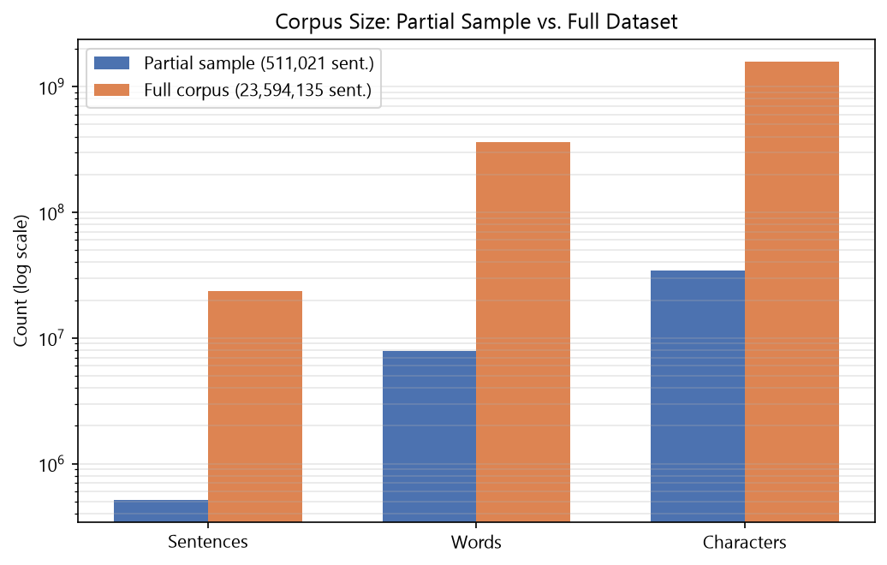
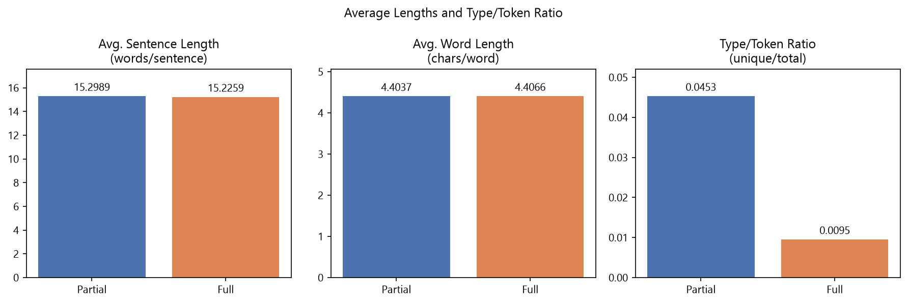
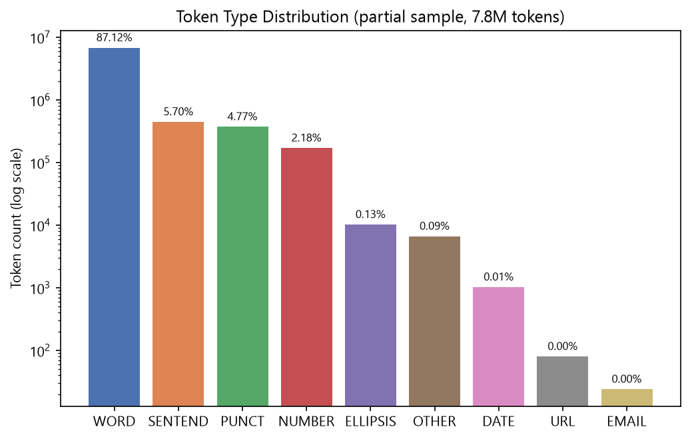
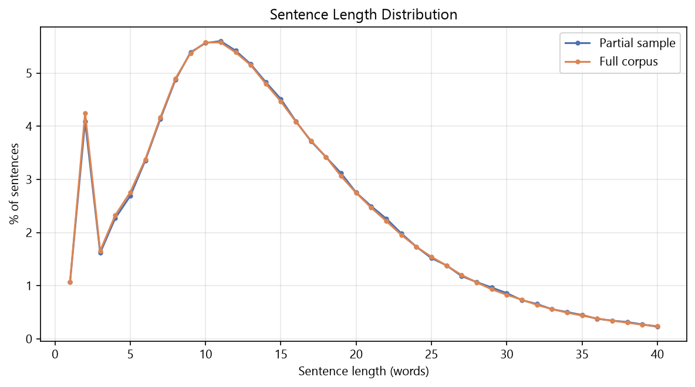
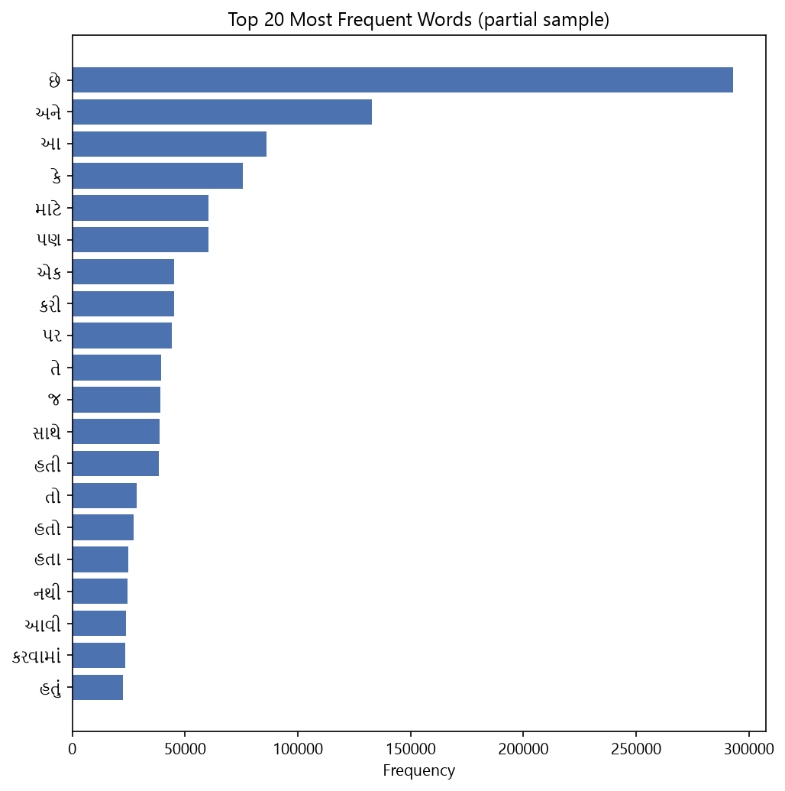
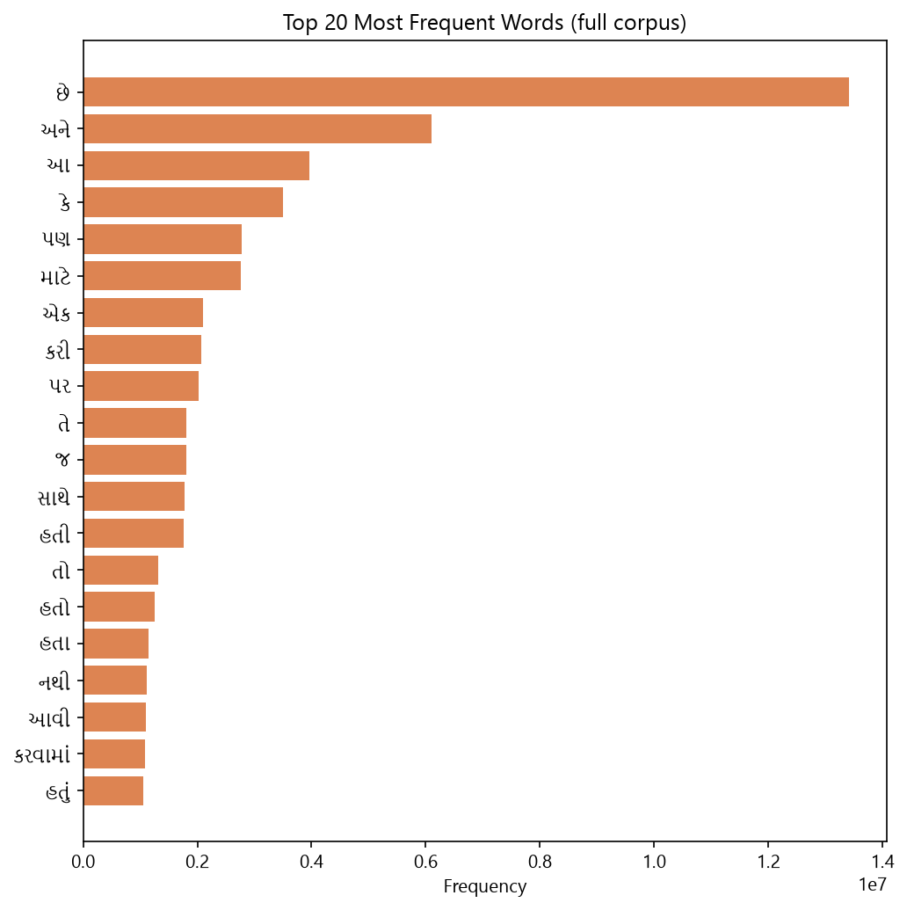

# Assignment 1 — Gujarati (guj_Gujr) Tokenization & Corpus Statistics

Sentence/word tokenizer and corpus-statistics pipeline built on the **guj_Gujr** split of
[ai4bharat/IndicCorpV2](https://huggingface.co/datasets/ai4bharat/IndicCorpV2), run twice —
once on a manageable partial sample and once on the entire language split — with results
kept in separate output folders for comparison.

> **Task 2 (OSCAR-2301) — skipped.** [oscar-corpus/OSCAR-2301](https://huggingface.co/datasets/oscar-corpus/OSCAR-2301)
> is a gated dataset requiring approved access; per instructions it was skipped and effort
> was redirected to completing Task 1 thoroughly (both a partial run and a full-corpus run).

---

## 1. Data source

- **Dataset**: `ai4bharat/IndicCorpV2`, config `indiccorp_v2`, split `guj_Gujr`
  (source file `data/gu.txt` on the main branch — a **14.1 GB** plain-text file, one
  paragraph per line, blank lines as paragraph separators).
- **Download method**: rather than pulling the 14.1 GB text file directly, the dataset's
  auto-generated `refs/convert/parquet` branch was used, which HuggingFace builds for every
  text dataset. This ships the same content pre-chunked into 10 Parquet shards
  (`0000.parquet` … `0009.parquet`, ~2.14 GB total, single `text` column, **15,300,157 rows**).
  Downloaded manually into `D:\CODING\NLP\Dataset\indiccorp_v2\partial-guj_Gujr\`.
- Exactly half of the 15.3M rows (7,650,078) are empty strings — the corpus uses blank rows
  as the paragraph-separator convention, matching the blank-line format seen in `gu.txt`.
  These are skipped during processing.

Two runs were produced from this data:

| Run | Source | Paragraphs processed | Purpose |
|---|---|---|---|
| **Partial sample** | first ~107 MB / 165,000 rows of shard `0000.parquet` | 165,000 | Fast iteration, disk-cheap, used to validate the pipeline |
| **Full corpus** | all 10 shards | 7,650,079 | The complete `guj_Gujr` split |

---

## 2. Repository layout

```
Assignment_1/
├── README.md
├── pyproject.toml / uv.lock          # uv-managed environment
├── src/
│   ├── tokenizer.py                  # sentence + word tokenizer (core logic)
│   ├── extract_data.py               # partial run: parquet -> data/raw_corpus.txt
│   ├── process_corpus.py             # partial run: tokenize -> output/tokenized.jsonl(+readable)
│   ├── compute_stats.py              # partial run: corpus statistics
│   ├── export_parquet_partial.py     # partial run: required Parquet storage format + chart data
│   ├── process_full_corpus.py        # full run: parquet shards -> tokenize -> output_full/tokenized.jsonl.gz + stats
│   ├── export_parquet_full.py        # full run: required Parquet storage format + chart data
│   └── visualize.py                  # generates all charts in assets/
├── data/
│   └── raw_corpus.txt                # partial run's extracted paragraphs (gitignored, regenerable)
├── output/                           # partial-run results
│   ├── tokenized.jsonl                    (gitignored, regenerable)
│   ├── tokenized_readable.txt             (gitignored, regenerable)
│   ├── tokenized_sentences.parquet    ★ required storage format
│   ├── corpus_statistics.txt / .json
│   └── analysis_partial.json          # token-type / word-freq / sentence-length aggregates
├── output_full/                      # full-corpus results
│   ├── tokenized.jsonl.gz             (gitignored, regenerable — 1.2 GB)
│   ├── tokenized_sentences.parquet    (gitignored, regenerable — 1.4 GB) ★ required storage format
│   ├── corpus_statistics.txt / .json
│   └── analysis_full.json
└── assets/                           # charts embedded below
```

**Why some files are gitignored:** the full run's intermediate JSONL (1.2 GB) and the
full-corpus Parquet (1.4 GB) exceed what's reasonable to commit to a normal Git repo (no
Git LFS in use here). The code to regenerate them is fully checked in; see §5 below. The
**partial-sample Parquet** (31 MB) *is* committed, since it's small and serves as the
concrete, inspectable deliverable for the required storage format.

---

## 3. Environment setup

Managed with [`uv`](https://docs.astral.sh/uv/):

```bash
uv venv .venv
uv sync
```

Dependencies: `pandas`, `pyarrow` (Parquet I/O), `regex` (Unicode-aware tokenization —
see §4), `matplotlib` (charts).

---

## 4. Tokenizer design (`src/tokenizer.py`)

### The core problem: Python's stdlib `re` breaks on Gujarati

Gujarati (like all Brahmic scripts) writes a syllable as a base consonant plus *dependent*
marks — vowel signs (matras), the virama `્`, anusvara `ં`, etc. Unicode puts these in
General Category **Mark (M)**, not Letter (L). Stdlib `re`'s `\w` only spans categories
L / Nd / Pc — **not** M — so a word like `કિંમત` gets shredded into six separate
one-character tokens. Switching to the third-party **`regex`** module gives access to
Unicode property classes `\p{L}` and `\p{M}`, so `WORD` is matched as `[\p{L}\p{M}]+` —
"a base letter plus every mark attached to it" — which is what a word actually *is* in
this script.

### One master regex, priority-ordered alternation

A single combined pattern (`EMAIL | URL | DATE | NUMBER | ELLIPSIS | SENTEND | PUNCT | WORD | OTHER`)
is scanned once per paragraph with `finditer()`. Python/`regex` alternation tries branches
**left to right at each position** and commits to the first match — so listing specific
patterns (email, URL, date, number) *before* the generic word/punctuation patterns is what
prevents `12/07/2023` from splitting into `12`, `/`, `07`, `/`, `2023`, or `3.14` from
splitting at the `.`, or `www.example.com` from being cut short at the first `.`.

| Type | Matches | Example |
|---|---|---|
| `EMAIL` | local@domain.tld | `test.user@example.co.in` |
| `URL` | `http(s)://…` or `www.…` (trailing sentence punctuation stripped and re-emitted separately) | `https://www.example.com/page` |
| `DATE` | `dd/mm/yyyy`, `dd-mm-yyyy`, `dd.mm.yyyy`, ISO `yyyy-mm-dd` | `12/07/2023`, `2023-07-12` |
| `NUMBER` | integers, decimals, Indian comma-grouping, optional `%`; Latin **and** Gujarati digits | `3.14`, `1,00,000`, `45%` |
| `ELLIPSIS` | `..`, `...`, `…` | |
| `SENTEND` | Gujarati danda `।`, double danda `॥`, runs of `!`/`?` | |
| `PUNCT` | everything else punctuation-ish (commas, quotes, brackets, dashes…) | |
| `WORD` | `[\p{L}\p{M}]+` — Unicode-aware letter+mark run | `કિંમત`, `Gujarati` |
| `OTHER` | catch-all single character, so nothing is silently dropped | emoji, misc symbols |

### Sentence tokenization reuses the word-token stream

Rather than a second, independent sentence-splitting regex, `sentence_tokenize()` walks the
*already-classified* tokens and starts a new sentence whenever it hits a `SENTEND` or
`ELLIPSIS` token. This is what makes "don't split on the period in a decimal / date / URL /
email" work **for free**: those periods were already consumed *inside* a `NUMBER`/`DATE`/
`URL`/`EMAIL` token upstream, so they never reach the sentence-splitter as a bare `.`.

**Abbreviation handling.** A single `.` immediately after a token in a fixed
`ABBREVIATIONS` lookup set (Gujarati honorifics `ડૉ`, `શ્રી`, `શ્રીમતી`, `પ્રો`, … plus
common English ones `Mr`, `Dr`, `Prof`, …) does **not** end the sentence — so
`"ડૉ. શાહ 3.14 વાગ્યે આવ્યા."` now correctly stays one sentence instead of splitting after
`ડૉ.`. This is a fixed list, not general abbreviation detection: any abbreviation not on
the list will still incorrectly end the sentence there, since there's no way to
distinguish it from a genuine sentence-final period without a lookup.

---

## 5. Pipeline — how to reproduce

**Partial sample:**
```bash
uv run src/extract_data.py            # parquet -> data/raw_corpus.txt (~107 MB, 165,000 paragraphs)
uv run src/process_corpus.py          # tokenize -> output/tokenized.jsonl + tokenized_readable.txt
uv run src/compute_stats.py           # -> output/corpus_statistics.{txt,json}
uv run src/export_parquet_partial.py  # -> output/tokenized_sentences.parquet + analysis_partial.json
```

**Full corpus** (~13-40 min per step depending on stage; streams directly from the parquet
shards / gzip JSONL rather than materializing an intermediate raw-text file, to stay within
available disk space):
```bash
uv run src/process_full_corpus.py     # all 10 shards -> output_full/tokenized.jsonl.gz + stats
uv run src/export_parquet_full.py     # -> output_full/tokenized_sentences.parquet + analysis_full.json
```

**Charts:**
```bash
uv run src/visualize.py               # -> assets/*.png (skips full-corpus charts if that run hasn't been done yet)
```

### Required storage format

Per the assignment spec, tokenized data is stored as **one tokenized sentence per row**,
words joined by spaces, e.g.:

| paragraph_id | sentence |
|---|---|
| 4 | `આખરે ત્રણ રાજ્યોમાં મળેલ હાર પર કોંગ્રેસ અધ્યક્ષ રાહુલ ગાંધી દ્વારા પ્રથમ પ્રતિક્રિયા આપવામાં આવી છે .` |

Saved as **compressed Parquet** (`compression="zstd"`) instead of a giant plain-text file,
since Parquet's columnar dictionary/RLE encoding compresses far better than a flat text
stream for a column this repetitive (see the top-20-words chart below — a handful of
function words dominate), and remains queryable with pandas/DuckDB without full
decompression.

---

## 6. Corpus statistics

| Metric | Partial sample | Full corpus |
|---|---:|---:|
| Total sentences | 511,021 | 23,594,135 |
| Total words (tokens) | 7,818,047 | 359,242,383 |
| Total characters | 34,428,416 | 1,583,053,314 |
| Average sentence length (words/sentence) | 15.2989 | 15.2259 |
| Average word length (chars/word) | 4.4037 | 4.4066 |
| Type/Token Ratio | 0.045301 | 0.009526 |
| Unique tokens | 354,162 | 3,422,061 |

> **Note on the two runs' tokenizer version:** the partial-sample numbers above reflect the
> tokenizer *after* the abbreviation-handling fix (§4) was added — 2,516 fewer, longer
> sentences than an earlier pass, because abbreviation periods (e.g. `ડૉ.`) no longer
> incorrectly split a sentence. Word/character counts and TTR are unaffected, since only
> sentence *boundaries* changed, not word tokenization itself. The **full-corpus** numbers
> were generated before this fix landed and were not re-run (the full pipeline takes
> ~40 minutes; abbreviations are rare enough in this corpus that the effect on
> aggregate stats is expected to be marginal — mainly a very slight reduction in sentence
> count and corresponding bump in average sentence length, mirroring the partial-run
> delta above).

**Definition used for "words":** every token the tokenizer emits — `WORD`, `NUMBER`,
`DATE`, `URL`, `EMAIL`, and punctuation (`PUNCT`/`SENTEND`/`ELLIPSIS`) tokens alike — since
the assignment explicitly asks the tokenizer to treat punctuation/numbers/URLs/dates/emails
as tokens too. This is a deliberate choice, not the only valid one: restricting "words" to
alphabetic tokens only (excluding punctuation) would give a lower average sentence length
(≈13.6) and a higher average word length (≈4.8) on the partial sample — punctuation tokens
are mostly single characters, so including them inflates the sentence-length count while
dragging down the average word length.

**Why TTR looks so different between the two runs:** this is expected behavior (Heaps'
Law), not an error — vocabulary size grows *sub-linearly* with token count, so as the
corpus gets much bigger, an increasing share of tokens are repeats of already-seen
high-frequency words rather than new vocabulary. Comparing raw TTR across corpora of very
different sizes is a known pitfall in corpus linguistics for exactly this reason.

---

## 7. Visual analysis

**Corpus size — partial vs. full (log scale).** The full corpus is ~46× more sentences but
proportionally similar in words/characters per sentence, confirming the partial sample was
drawn representatively rather than being skewed toward longer or shorter documents.



**Average lengths & TTR side by side.** Sentence length and word length are essentially
identical between the two runs (15.22 vs 15.23 words/sentence; 4.40 vs 4.41 chars/word) —
strong evidence the 165K-paragraph sample is representative of the full split. TTR is the
one metric that predictably diverges, for the Heaps'-Law reason above.



**Token type distribution (partial sample, 7.8M tokens).** `WORD` dominates at 87.1%;
`SENTEND` (5.7%) and `PUNCT` (4.8%) together account for most of the rest; `NUMBER` at
2.2%; `DATE`/`URL`/`EMAIL` are vanishingly rare (<0.02% combined) — consistent with this
being general news/web prose rather than structured/tabular text.



**Sentence length distribution.** Partial-sample and full-corpus curves are visually
indistinguishable — another representativeness check. The small spike at length 2 is
short/fragment lines (e.g. headline-style paragraphs) common in this kind of scraped news
corpus.



**Top 20 most frequent words.** Dominated by function words/copulas — `છે` (is), `અને`
(and), `આ` (this), `કે` (that/or), `માટે` (for), `પણ` (also/but) — exactly the Zipfian
pattern expected of any natural-language corpus. Rank order is **identical** between the
partial sample and the full corpus, only the absolute frequencies scale up.

Partial sample:


Full corpus:


---

## 8. Design notes & limitations

- **No abbreviation handling** — honorifics/abbreviations ending in `.` (e.g. `ડૉ.`) will
  incorrectly terminate a sentence; fixing this would require an abbreviation dictionary.
- **"Words" includes punctuation tokens** in the corpus-statistics counts (§6) — a
  deliberate, documented choice, not the only valid convention.
- **Full-corpus run streams directly from the source Parquet shards / gzip JSONL** rather
  than materializing an intermediate raw-text file, and writes output as gzip/zstd-
  compressed formats throughout — the naive "partial-run approach at 46× scale" would have
  needed ~33 GB of intermediate+output disk space against ~32 GB actually free at the time.
- **Word-frequency counts for the full corpus** were reconstructed by re-testing each saved
  token string against the `WORD` regex (`[\p{L}\p{M}]+` fullmatch), rather than reusing
  the original per-token type labels — those labels aren't persisted in
  `tokenized.jsonl.gz` (only token text is, to keep that file smaller), so this is an
  approximation: any punctuation-free token shape (which is all `WORD` tokens, by
  construction) is counted, which is correct here but would misfire if the tokenizer's
  `WORD` pattern were changed without updating this reconstruction logic too.
