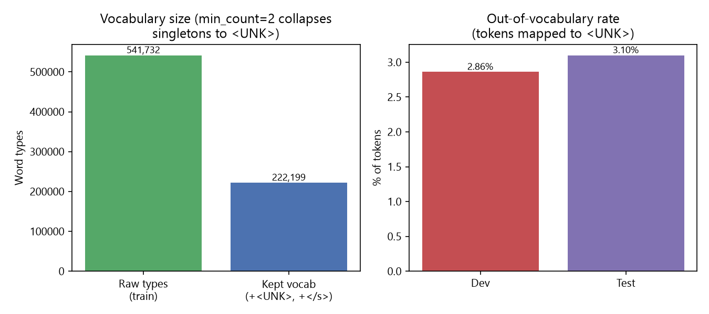
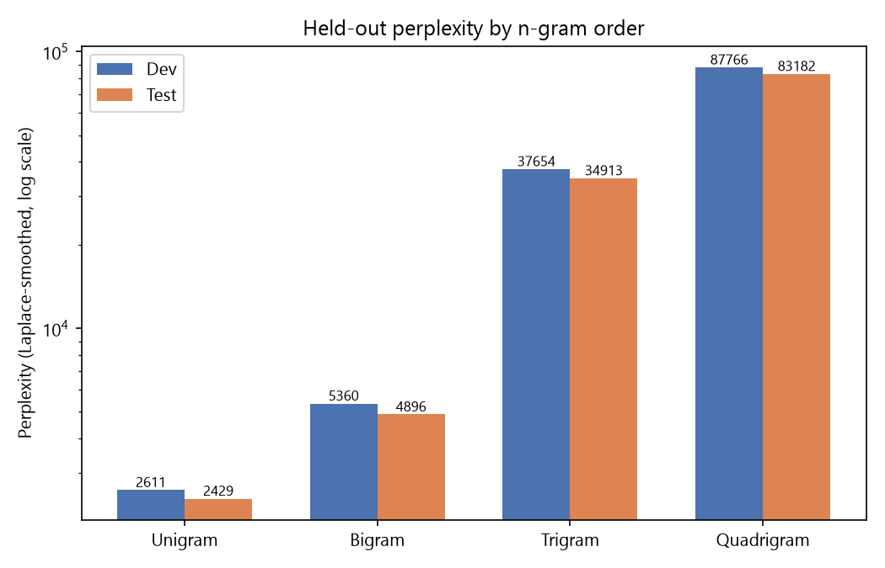
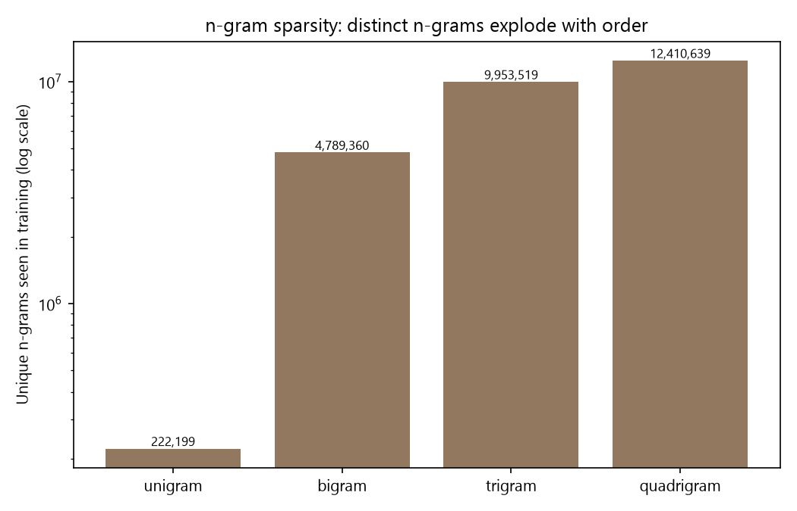

# Lab 4 — N-gram Language Models with Laplace Smoothing

Unigram, bigram, trigram, and quadrigram language models trained on the
Gujarati (`guj_Gujr`) corpus tokenized in [Assignment 1](../Assignment_1),
with **Add-one (Laplace) smoothing**, evaluated by perplexity on held-out
dev/test splits.

## 1. Data

Rather than re-downloading and re-tokenizing a corpus, this lab reuses
Assignment 1's finished output:
[`Assignment_1/output_full/tokenized_sentences.parquet`](../Assignment_1/output_full/tokenized_sentences.parquet) —
23,594,135 already word-tokenized Gujarati sentences (one sentence per row,
tokens space-joined, punctuation/numbers/URLs kept as their own tokens per
Assignment 1's tokenizer).

**Sampling (`src/build_splits.py`).** The assignment asks for "at least
1,000,000 sentences." Taking the first 1M rows of the parquet file would
bias the sample toward whatever document was processed first, so instead a
**systematic sample** is drawn — every *k*-th row across the entire file
(*k* = 23,594,135 ÷ 1,000,000 ≈ 23) — giving 1,000,000 sentences spread
evenly across the whole corpus. This is done with `pyarrow`'s streaming
`iter_batches`, so the 1.4 GB file is never fully materialized in memory.

**Split.** The 1,000,000 sampled sentences are shuffled (fixed seed 42) and
sliced:

| Split | Sentences | File |
|---|---:|---|
| Train | 998,000 | [`output/train.txt`](output/train.txt) |
| Dev   | 1,000   | [`output/dev.txt`](output/dev.txt) |
| Test  | 1,000   | [`output/test.txt`](output/test.txt) |

(`output/train.txt`/`dev.txt`/`test.txt` are regenerable via
`src/build_splits.py` and gitignored if large; `output/results.json` and the
`assets/*.png` charts are the committed deliverables.)

## 2. Models (`src/ngram_model.py`)

All four orders (n = 1, 2, 3, 4) are counted in a **single pass** over the
training data for efficiency: each sentence is padded with 3×`<s>` at the
start and one `</s>` at the end (3 = max order − 1), and at every position
past the padding, the unigram/bigram/trigram/quadrigram ending there are all
incremented together.

**Vocabulary & `<UNK>`.** Words seen exactly once in training (singletons)
are collapsed to `<UNK>` — this gives the model a defined way to assign
probability to words it has never seen, and any dev/test word absent from
the resulting vocabulary is mapped to `<UNK>` at evaluation time too. This
shrank the raw 541,732 training word types down to a vocabulary **V =
222,199** (kept words + `<UNK>` + `</s>`; `<s>` is excluded from V since it's
only ever context, never a predicted token — a standard convention). 2.86%
of dev tokens and 3.10% of test tokens fall outside this vocabulary and are
scored as `<UNK>`.



**Laplace (add-one) smoothing:**

```
P(w_n | w_1..w_n-1) = (C(w_1..w_n) + 1) / (C(w_1..w_n-1) + V)
```

Because the `+1`/`+V` terms guarantee a non-zero probability even for a
context or n-gram never seen in training, this needs no separate
backoff/fallback logic — every n-gram, seen or not, gets a well-defined
probability.

**Perplexity.** For a sentence set, `PP = exp(-1/M * Σ log P(w_i | context))`
summed over every real token position (from the end of the `<s>` padding
through `</s>`) across all sentences, where `M` is that same token count for
every order — so the four models' perplexities are computed over exactly
the same set of predicted tokens and are directly comparable.

## 3. Results (`src/train_eval.py` → `output/results.json`)

| Order | Unique n-grams (train) | Dev perplexity | Test perplexity |
|---|---:|---:|---:|
| Unigram    | 222,199    | 2,610.93  | 2,429.28  |
| Bigram     | 4,789,360  | 5,359.84  | 4,896.38  |
| Trigram    | 9,953,519  | 37,653.83 | 34,912.75 |
| Quadrigram | 12,410,639 | 87,766.19 | 83,181.82 |



**Perplexity gets *worse* as the order increases — this is the expected,
well-documented failure mode of add-one smoothing, not a bug.** Laplace
smoothing adds 1 to *every* possible n-gram, including the astronomically
many that were never seen. For higher orders the number of distinct n-grams
explodes (222K unigrams → 12.4M quadrigrams in training alone, and the
space of *possible* quadrigrams over a 222K vocabulary is far larger still),
so add-one smoothing ends up redistributing most of the probability mass
onto n-grams that don't occur — starving the n-grams that *do* occur of
probability and inflating perplexity. This is precisely why real systems use
Good-Turing, Kneser-Ney, or interpolation/backoff instead of add-one for
anything beyond a teaching example; add-one is simple and always well-
defined, but it over-smooths badly as sparsity grows with n.



**Dev vs. test.** Test perplexity is consistently a bit lower than dev
across all four orders (e.g. 2,429 vs. 2,611 for the unigram model) — both
are held-out sets drawn from the same systematic sample and shuffled
together, so this reflects ordinary sampling variance between two
1,000-sentence draws rather than any systematic difference.

**Qualitative check.** The trigram model's top-5 next-word predictions for
a few dev-set contexts (`output/results.json` → `trigram_examples`) are
linguistically sensible, e.g. after `એક રિપોર્ટ` ("a report") the top
candidates are `અનુસાર`/`મુજબ`/`પ્રમાણે` — three near-synonyms all meaning
"according to," exactly what should follow "a report" in Gujarati news
prose.

## 4. Run it

```bash
uv sync
uv run src/build_splits.py   # -> output/{train,dev,test}.txt, split_meta.json (~1-2 min)
uv run src/train_eval.py     # -> output/results.json (~9 min: counts 16.2M training tokens x 4 orders)
uv run src/visualize.py      # -> assets/*.png
```

or all three in one go: `uv run src/main.py`.

## 5. Design notes & limitations

- **Add-one smoothing only**, as specified by the assignment — no
  backoff/interpolation, which is exactly why the perplexity-vs-order trend
  above runs the "wrong" way. A Kneser-Ney or interpolated model would be
  expected to *improve* with order instead.
- **`<UNK>` threshold** is a single free parameter (`min_count=2` in
  `ngram_model.py`); a stricter/looser threshold trades vocabulary size
  against OOV rate.
- **Tokens include punctuation/numbers** (e.g. sentence-final `.` is its own
  token), inherited from Assignment 1's tokenizer convention — consistent
  with how that assignment defined "words" for its own statistics.
- **Sample size**: 1,000,000 of the corpus's 23.6M sentences were used
  (satisfying the assignment's "at least 1,000,000" requirement while
  keeping n-gram counting tractable); the systematic sampling means this
  million is spread across the entire corpus rather than concentrated in
  one region of it.
