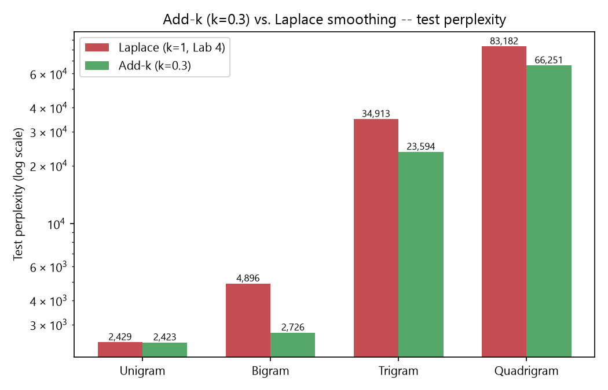
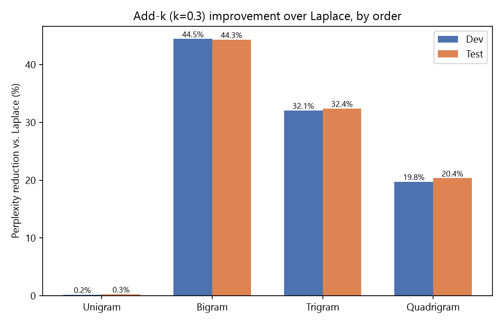
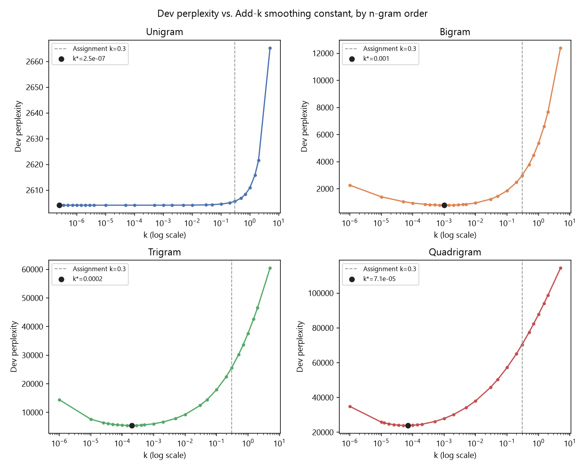

# Lab 5 — Add-k Smoothing (k = 0.3) for N-gram Language Models

Add-k smoothing applied to the same four n-gram language models
(unigram/bigram/trigram/quadrigram) trained in
[Assignment 4](../Assignment_4) on the Gujarati (`guj_Gujr`) corpus, tested
on the same held-out dev/test splits, and compared against Assignment 4's
Add-one (Laplace) results.

## 1. Data

Reuses Assignment 4's finished split directly — no re-sampling:
[`Assignment_4/output/{train,dev,test}.txt`](../Assignment_4/output) (998,000
/ 1,000 / 1,000 sentences). The assignment asks to smooth "all 4 models you
developed in the previous assignment," so the data, vocabulary, and n-gram
counts are kept identical to Lab 4 — only the smoothing constant changes —
which is what makes the two labs' perplexities directly comparable.

## 2. Model (`src/ngram_model.py`)

Counting is unchanged from Lab 4 (single pass over training data, `<s>`×3 /
`</s>` padding, singleton words collapsed to `<UNK>`, giving the same
vocabulary **V = 222,199**). The only change is the scoring formula —
**Add-k smoothing** generalizes Laplace by replacing the `+1`/`+V` constants
with a tunable `k`:

```
P_add-k(w_i | w_i-N+1..w_i-1) = (C(w_i-N+1..w_i) + k) / (C(w_i-N+1..w_i-1) + k*V)
```

With **k = 0.3** (as specified), each unseen n-gram is assigned less
"borrowed" probability mass than Laplace's k=1 does, so less mass is stolen
from n-grams that were actually observed. (k=1 recovers exactly Lab 4's
Laplace model — `add_k_prob(n, ngram, k=1)` is
[`ngram_model.py`](../Assignment_4/src/ngram_model.py)'s `laplace_prob`.)

## 3. Results (`src/train_eval.py` → `output/results.json`)

| Order | Laplace (k=1) dev PP | Add-k (k=0.3) dev PP | Laplace test PP | Add-k test PP | Reduction (test) |
|---|---:|---:|---:|---:|---:|
| Unigram    | 2,610.93  | 2,605.64  | 2,429.28  | 2,422.63  | 0.3%  |
| Bigram     | 5,359.84  | 2,976.94  | 4,896.38  | 2,725.88  | 44.3% |
| Trigram    | 37,653.83 | 25,575.86 | 34,912.75 | 23,594.46 | 32.4% |
| Quadrigram | 87,766.19 | 70,423.65 | 83,181.82 | 66,251.18 | 20.4% |





**Add-k beats Laplace at every order, and the gap is a story about V, not
about `k` alone.** The correction term subtracted from unseen n-grams'
share of probability mass scales with `k·V`; with `V = 222,199`, Laplace's
`k=1` term dwarfs any observed count for bigrams and up, so nearly all
probability mass gets redistributed onto unseen n-grams. Dropping to `k=0.3`
shrinks that term to 30% of Laplace's, which is why the biggest relative
gain (44.5%/44.3% dev/test) shows up at the **bigram** order: bigram counts
are populated enough that the smoothing constant is the dominant source of
distortion, so cutting it has maximum leverage. The unigram order barely
moves (0.2%/0.3%) because there is no context to sparsify — `C(context)` is
just the total token count (~16.2M), so `k·V` (≈66,660 at k=0.3, ≈222,199 at
k=1) is a rounding error either way. Trigram and quadrigram improve less
than bigram in relative terms because at those orders almost every test
n-gram is itself unseen in training regardless of `k`, so both models are
still dominated by the "spread mass over the (astronomically large) unseen
n-gram space" failure mode that Assignment 4 diagnosed — add-k with k=0.3 is
a smaller version of the same over-smoothing, not a fix for it.

**Perplexity still gets worse as order increases**, exactly as in Lab 4 and
for the same reason: no amount of shrinking `k` changes the fact that
add-k-family smoothing distributes probability mass uniformly over the
entire vocabulary space, which grows combinatorially with n. A real fix
needs a smoothing method that only backs off to lower-order estimates for
n-grams that are actually similar in distribution (Good-Turing, Kneser-Ney,
interpolation) rather than a flat additive constant.

## 4. Run it

```bash
uv sync
uv run src/main.py     # -> output/results.json, assets/*.png, LAB-5-Report.pdf (~2 min)
```

(Assumes [Assignment 4](../Assignment_4)'s `output/{train,dev,test}.txt`
already exist — see that lab's README to regenerate them if needed.)

## 5. Bonus: tuning k instead of taking it as given (`src/k_sweep.py`)

The assignment specifies k=0.3, but that value was never *chosen* for this
corpus — so as a follow-up experiment, `src/k_sweep.py` reuses the same
n-gram counts and sweeps ~20 log-spaced k values (1e-6 to 5) per order,
picking whichever k minimizes **dev** perplexity (never test — picking a
hyperparameter by looking at the test set would leak it into the model
choice), then reports how that choice generalizes to test.



| Order | k\* (minimizes dev PP) | Dev PP @ k\* | Test PP @ k\* | Test PP @ k=0.3 (assignment) |
|---|---:|---:|---:|---:|
| Unigram    | ≈0 (flat)  | 2,604.16  | 2,420.40  | 2,422.63  |
| Bigram     | 0.001      | 791.30    | 748.98    | 2,725.88  |
| Trigram    | 0.0002     | 5,440.48  | 5,025.62  | 23,594.46 |
| Quadrigram | 0.0000707  | 23,937.61 | 21,947.91 | 66,251.18 |

**The optimal k is *much* smaller than 0.3, and it shrinks further as order
increases.** For bigram/trigram/quadrigram the curve is a genuine
bias–variance U-shape, not a monotonic one:

- **Large k (right side, including k=0.3):** over-smoothing — too much
  mass is redistributed to n-grams that never occur, exactly the Lab 4
  failure mode.
- **k → 0 (left side):** under-smoothing — any dev/test n-gram whose
  *context* was seen in training but whose specific continuation wasn't
  gets an almost-zero probability (`k/(C(context)+k·V) → 0`), which
  devastates perplexity through the `log P` term. This is why perplexity
  turns back *up* at the far left of each curve instead of continuing to
  fall.
- The minimum sits where these two error sources balance, and that balance
  point moves left (toward smaller k) as order increases, because sparser
  higher-order contexts have more "seen-context, unseen-continuation" cases
  for a given k to mismanage.

**Unigram has no such U-shape** — its curve is essentially flat below k≈0.1
before rising. A unigram's context is the empty context, so `C(context)` is
the total token count (~16.2M); every vocabulary word (by construction of
the `min_count=2` vocabulary) already occurs at least twice in training, so
there is no seen-context/unseen-continuation case to blow up as k shrinks —
the model just converges smoothly to its MLE unigram distribution.

**This doesn't change the k=0.3 results above**, which is what the
assignment asked for; it's included as a demonstration of *why* 0.3 is a
reasonable-but-arbitrary teaching value rather than a tuned one, and of the
correct way to tune a smoothing hyperparameter (minimize on dev, report on
test, never the reverse). Run it with `uv run src/k_sweep.py && uv run src/visualize_k_sweep.py`
(~3 min; re-counts n-grams once, then sweeps ~30 k-values per order cheaply).

## 6. Design notes & limitations

- **`train_eval.py` uses k = 0.3 only**, as specified by the assignment
  (`K` is the one constant to change for a different fixed value); the
  actual best-k-per-order search lives separately in `src/k_sweep.py`
  (§5), so the required deliverable and the exploratory tuning don't
  overwrite each other's output files.
- **Vocabulary and `<UNK>` threshold** (`min_count=2`) are held fixed at
  Assignment 4's values so the comparison isolates the effect of `k` alone.
- Trigram example next-word predictions are re-included in
  `output/results.json` for completeness, but add-k only rescales observed
  counts by a constant offset — it does not change the *ranking* of
  attested continuations for a given context, so they're identical to
  Lab 4's.
- [`LAB-5-Report.pdf`](LAB-5-Report.pdf) is the formatted lab report (color
  -coded pass/fail-style result tables and the charts above), generated by
  `src/report.py`.
